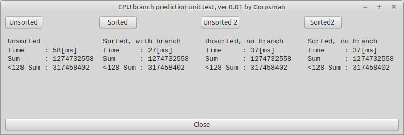

# CPU Branch prediction

In this "research" i try to show the benefit of modern CPU branch prediction units and how we can use this information when coding speed critical code. This evaluation is long known to me, but [this](https://www.youtube.com/watch?v=-HNpim5x-IE) youtube video, finally let me create this evaluation below ;).

### Short summary

Try to avoid branches, whereever possible (see also [Algorithmica](https://en.algorithmica.org/hpc/pipelining/branchless/) ).

### Detailed discussion

Modern CPU's are organized in pipelines, this means that a single instruction written by the programmer does not take only one cycle. Even a single assembler instruction can take multiple cpu cycles (depending on the instruction). Extreme simplified we have at least these simplified pipeline:


 > | Instruction fetch | -> | Instruction decode | -> | execution | -> | write back |

 If you want to learn more about CPU-pipelines i recommend starting with the [Wikipedia](https://en.wikipedia.org/wiki/Instruction_pipelining) version.

Pipelines have the benefit of "running" multiple commands at a single CPU-cylce using all the hardware that is there. But when it comes to branches the pipelines effectivness can be completly "destroyed". This is due to the fact, that the CPU can only fill up the pipeline with one branch of the code. If the branch evaluates to be "the other" one, all the already processed data in the pipeline needs to be thrown away and the pipeline needs to be filled up with "the other" branches code. This costs time (CPU cycles) and slows down the programm execution.

To takle this issue, modern CPU's are containing branch prediction units that try to guess which branch will be taken and therefore reduce the waste of time, when flushing the pipline.

To show this a little better we try to solve the following example:

## Task
When given a array of bytes, calculate the:
- sum of all elements
- sum of all elements that are lesser than 128

## Naive solution

This task can be easy solved by the following FreePascal code (using x from a TPoint as sum and y as sum of < 128 values):

```pascal
// Pascal
Function CalcSums(Const a: Array Of Byte): Tpoint;
Var
  i: Integer;
Begin
  result.x := 0;
  result.Y := 0;
  For i := 0 To high(a) Do Begin
    > result.x := result.x + a[i];
    If a[i] < 128 Then Begin // (1)
      result.y := result.y + a[i];
    End;  
  End; // (2)
End;
```

This code has two branches (1) and (2), the branch (1) is the one we are interested in here, as this branch is highly dependant to the data and "unpredictable". The branch (2) is relativly easy as it will do most of the time a "jump" back to the beginning of the loop.
When initializing the data with random numbers in general, every second branch of (1) needs to clear the CPU-Pipeline and "cost" time (see below screenshot "Unsorted").

## Speedup by "changing" the data

As we already figured out, the "slow" execution of the code shown above, is due to the fact, that the branch (1) will lead to a pipeline flush in approx 50% of all executions. A "simple" solution to the problem could be, to sort the data and make the branch (1) more predictable (we ignore here the cost of sorting the data, as we are analysing the branch prediction unit and not the sorting of data). Indeed this reduces the execution time by a lot (see below screenshot "Sorted"). The explenation is simple, the branch (1) will now the very first half of the data be executed, than branch prediction unit soon will "learn" that it will never be hit anymore and skip it. The prediction of branch (2) does not change.

## Speedup by "changing" the algorithm and removing the branch

In the previos approach we sorted the data (and ignored the cost for sorting). If sorting the data came to a cost (which can not be ignored), then we need to find a way of changing the code in a way that it does not rely on sorted data. Indeed this is possible in our example: 


```pascal
// Pascal
Function CalcSums2(Const a: Array Of Byte): Tpoint;
Var
  i: Integer;
  tmp: Byte;
Begin
  result.x := 0;
  result.Y := 0;
  For i := 0 To high(a) Do Begin
    result.x := result.x + a[i];
    // Remove branch (1) by "calculating"
    // Reduce the if condition to 0 / 1 and then multiply a[i] during summation
    tmp := (Not (a[i] And $80) Shr 7) * a[i];
    result.y := result.y + tmp;
  End; // (2)
End;
```
The given code reduces the branch at the cost of some more "simple" instructions. When executing the code we can see that the execution is faster (see below screenshot "Unsorted 2") as the unsorted version. The fact that the execution is not the same as the sorted version comes from the calculation overhead.

As final validation step we also run the sorted data with the reduced branch version. As it can be seen, the execution time does not differ (see below screenshot "Sorted 2"). This again makes sense, as both versions run the same amount of branches.



## Conclusion
- Flushing the CPU pipeline comes at a high cost.
- The CPU branch prediction unit can increase the code execution dramatically (compare "Unsorted" with "Sorted").
- The CPU branch prediction unit rely on the algorithm to be "good shaped" to be effective (in this example sorted data).
- When execution time is critical, it makes sense to have a look at the code that is beeing executed frequently (remove branches or reoder data to make code more predictable).


### Dicussion of reliability of the results:

The time measurements of the above screenshot and the shared code are dramatically dependant to the used hardware. But should scale to different hardware, meaning that the results should shift to grater values (if ran on a slower CPU) or smaller values (if ran on a more powerfull CPU). If you do not see any changes between "Sorted" and "Unsorted" times, i assume you are using a CPU which does not have a branch prediction unit at all.

All tests where executed on a : "AMD Ryzen 7 7730U with Radeon Graphics".