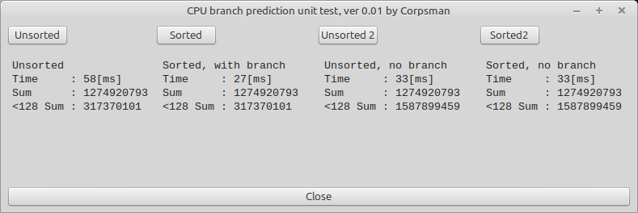

# CPU Branch Prediction

In this “research,” I aim to demonstrate the benefits of modern CPU branch prediction units and how this knowledge can be leveraged when writing speed-critical code.  
This evaluation has been familiar to me for some time, but [this YouTube video](https://www.youtube.com/watch?v=-HNpim5x-IE) finally inspired me to create the detailed evaluation below 😉.


### Short Summary

Avoid branches wherever possible (see also [Algorithmica](https://en.algorithmica.org/hpc/pipelining/branchless/)).

### Detailed Discussion

Modern CPUs are organized in pipelines, which means that a single instruction written by the programmer does not necessarily take only one cycle to complete. Even a single assembly instruction can take multiple CPU cycles, depending on the instruction. Simplified, the pipeline consists of these stages:

> | Instruction Fetch | → | Instruction Decode | → | Execution | → | Write Back |

If you want to learn more about CPU pipelines, I recommend starting with the [Wikipedia article on instruction pipelining](https://en.wikipedia.org/wiki/Instruction_pipelining).


Pipelines allow the CPU to process multiple instructions simultaneously, increasing hardware utilization. However, when it comes to branches, pipeline efficiency can be significantly reduced. Without branch prediction, the CPU must wait until the correct branch is known before filling the pipeline. This means that when a branch occurs, the pipeline can only be filled with one possible branch’s instructions, and if it turns out to be the other branch, all instructions already in the pipeline must be discarded and replaced with the correct ones. This flushing process costs CPU cycles and slows down program execution.

To tackle this issue, modern CPUs include branch prediction units that try to guess which branch will be taken, reducing the performance loss caused by pipeline flushing.

To illustrate this better, let's consider the following example:

## Task
Given an array of bytes, calculate:  
- The sum of all elements  
- The sum of all elements less than 128  


## Naive Solution

This task can be easily solved with the following FreePascal code (using `x` from a `TPoint` as the total sum and `y` as the sum of values less than 128):

```pascal
// Pascal
Function CalcSums(Const a: Array Of Byte): Tpoint;
Var
  i: Integer;
Begin
  result.x := 0;
  result.Y := 0;
  For i := 0 To high(a) Do Begin
    result.x := result.x + a[i];
    If a[i] < 128 Then Begin // (1)
      result.y := result.y + a[i];
    End;  
  End; // (2)
End;
```

This code has two branches: (1) and (2). The branch at (1) is the one we are interested in, as it is highly data-dependent and therefore unpredictable. Branch (2) is relatively straightforward since it usually jumps back to the start of the loop.

When initializing the data with random numbers, roughly every second evaluation of branch (1) causes the CPU pipeline to be cleared, which "costs" time (see the measurements below the **Unsorted** button in the screenshot).

## Speedup by "Changing" the Data

As we’ve seen, the slow execution of the previous code is mainly due to branch (1) causing a pipeline flush in approximately 50% of all executions.  

A simple way to improve this is to sort the data, making branch (1) much more predictable. (We ignore the cost of sorting here, since our focus is on analyzing the branch prediction unit, not the sorting itself.)  

Indeed, this greatly reduces execution time (see the measurements below the **Sorted** button in the screenshot). The explanation is straightforward: branch (1) will be taken for roughly the first half of the data. After that, the branch prediction unit quickly “learns” that the condition will no longer be true and effectively skips it. The behavior of branch (2) remains unchanged.

## Speedup by "Changing" the Algorithm and Removing the Branch

In the previous approach, we sorted the data (ignoring the cost of sorting). However, if sorting is costly and cannot be ignored, we need to modify the code so that it does not rely on sorted data. Fortunately, this is possible in our example:

```pascal
// Pascal
Function CalcSums2(Const a: Array Of Byte): TPoint;
Var
  i: Integer;
  tmp: Byte;
Begin
  result.x := 0;
  result.y := 0;
  For i := 0 To High(a) Do Begin
    result.x := result.x + a[i];
    // Remove branch (1) by "calculating"
    // Convert the if condition to 0 or 1, then multiply by a[i] during summation
    tmp := (Byte((Not a[i]) Shr 7)) * a[i];
    result.y := result.y + tmp;
  End; // (2)
End;
```

This code eliminates the branch at the cost of a few simple extra instructions. When executed, it runs faster than the original unsorted version (see the measurements below the **Unsorted 2** button in the screenshot). The execution is not as fast as the sorted version, due to the added calculation overhead.

As a final validation step, we also run the reduced-branch version on the sorted data. As shown in the measurements below the **Sorted 2** button in the screenshot, the execution time does not differ significantly. This makes sense, as both versions execute the same number of branches.



## Conclusion
- Flushing the CPU pipeline incurs a high performance cost.  
- The CPU branch prediction unit can significantly improve code execution speed (compare **Unsorted** with **Sorted**).  
- Branch prediction effectiveness depends on the algorithm’s structure—sorted data in this example improves predictability(**Sorted**).  
- When execution time is critical, it is beneficial to examine frequently executed code to remove branches or reorder data for better predictability (**Sorted**, **Unsorted2**).

### Discussion of Reliability of the Results

The timing measurements shown in the screenshot and the provided code are highly dependent on the hardware used. However, the results should scale across different hardware—that is, the measured times should increase on slower CPUs and decrease on more powerful ones.

If you do not observe any difference between the **Sorted** and **Unsorted** times, it is likely that your CPU does not have a branch prediction unit, or you run the tests on a Windows system (see [Gettickount64](../Gettickcount64)).

All tests were executed on an **AMD Ryzen 7 7730U with Radeon Graphics**.
