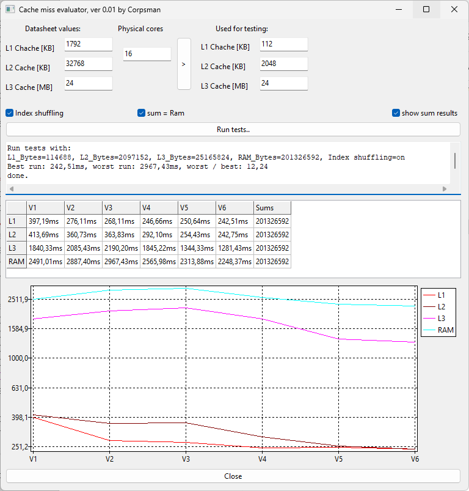
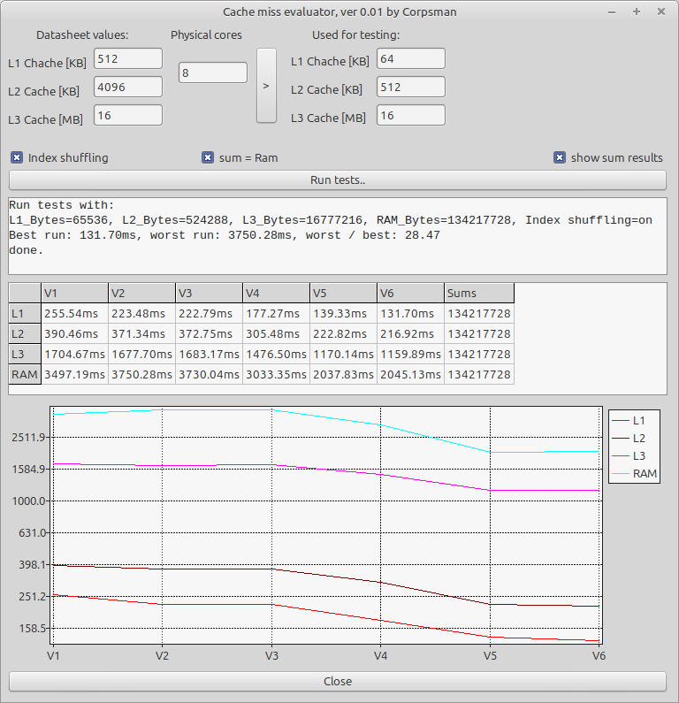
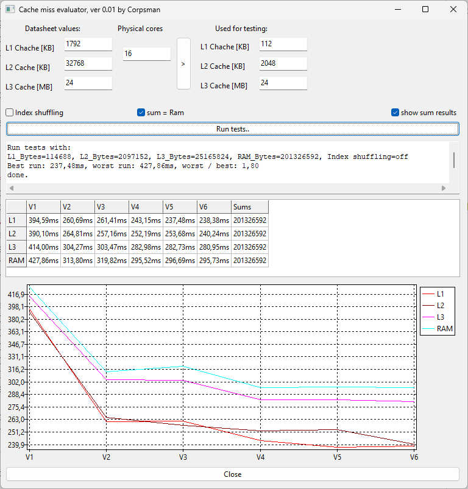
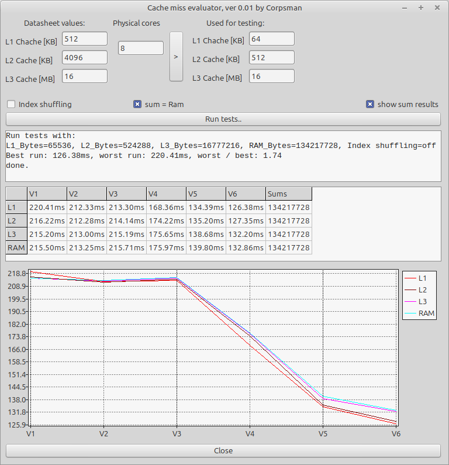

# Cache compare


>
> ! Attention !
> This is a work in progress
>

Inspired by the book [Game Physics Engine Development](https://www.amazon.de/-/en/Game-Physics-Engine-Development-Commercial-Grade/dp/0123819768) page 435 headline "Grouping Data for Areas of the Level", i wanted to see how much effect the location of data in memory really has to the execution time of a application and which other effects can speedup the executions.

### Short Summary

Avoid accessing random memory areas as this can effect the CPU's [cache prefetching](https://en.wikipedia.org/wiki/Cache_prefetching) algorithms in a bad way. Also take care when using variables in Objects as the implizit derefering can consume a lot of CPU time.

### Detailed Discussion

In contemporary computer systems, memory management is structured as a hierarchical model designed to balance speed and capacity. At the top of this hierarchy lie the processor-integrated caches—namely L1, L2, and L3—which differ in size and latency. L1 cache is the smallest and fastest, located closest to the CPU cores, followed by the larger and slightly slower L2 and L3 caches. Beyond these, the system accesses the main memory (RAM), which offers significantly greater capacity but at the cost of increased access time.
To mitigate latency and optimize performance, modern CPUs employ [cache prefetching](https://en.wikipedia.org/wiki/Cache_prefetching) techniques. These mechanisms anticipate future memory accesses and proactively load data into the cache before it is explicitly requested by the executing program. This predictive behavior enhances throughput and reduces the frequency of costly memory fetches from lower levels of the hierarchy.

## Task

To investigate the performance characteristics of different memory layers—namely L1, L2, L3 caches and RAM - a controlled benchmarking task has been designed. The core computational problem involves calculating the sum of all elements within a given array. While conceptually simple, this operation serves as an effective probe for memory access patterns and latency effects across the hierarchy.
A critical aspect of the experiment is the consistency of iteration counts across all memory layers. Since the array sizes must scale with the respective buffer sizes to ensure meaningful cache utilization, the number of iterations must remain constant to preserve comparability. This ensures that performance differences are attributable solely to memory access behavior rather than computational workload.

The memory region's width is defined via the ElementCount parameter, which specifies the number of elements in the array. 
The Iterations parameter specifies the total number of summation operations performed across all four memory layers. It remains constant throughout the tests to ensure that the results are directly comparable. 

In total, six distinct implementation variants are evaluated to compare performance across different memory configurations. Each variant is encapsulated in a function with the following FreePascal signature:

```pascal
Function V<number>(ElementCount, Iterations: integer): double;
```

All operations are performed on preallocated memory regions to ensure that memory allocation overhead does not interfere with the timing measurements. This approach isolates the actual computational performance from initialization effects, thereby improving the accuracy and reliability of the benchmark results.

The following six variants implement the same summation task but differ in their use of optimization techniques and structural design. Each version aims to highlight specific aspects of performance behavior in relation to memory access and CPU efficiency.


1. Naive Implementation: A straightforward loop-based summation without any optimizations. Serves as the baseline for comparison.
   
```pascal
Function TForm1.V1(ElementCount, Iterations: integer): double;
Var
  i: Integer;
Begin
  sum := 0;
  EpikTimer1.Clear;
  EpikTimer1.Start;

  For i := 0 To Iterations - 1 Do Begin
    sum := sum + DataArray[IndexArray[i Mod ElementCount]];
  End;

  result := EpikTimer1.Elapsed() * 1000;
End;
```

2. Modulo-Free with Branching: The modulo operation is removed to reduce computational overhead. However, this introduces a conditional branch, which may affect performance due to branch prediction behavior.

```pascal
Function TForm1.V2(ElementCount, Iterations: integer): double;
Var
  IndexIndex, i: Integer;
Begin
  sum := 0;
  IndexIndex := 0;
  EpikTimer1.Clear;
  EpikTimer1.Start;

  For i := 0 To Iterations - 1 Do Begin
    sum := sum + DataArray[IndexArray[IndexIndex]];
    inc(IndexIndex);
    If IndexIndex = elementCount Then IndexIndex := 0;
  End;

  result := EpikTimer1.Elapsed() * 1000;
End;
```

3. Predictable Branching: An attempt to make the conditional branch introduced in Variant 2 more predictable for the CPU, potentially improving instruction pipeline efficiency. 

```pascal
Function TForm1.V3(ElementCount, Iterations: integer): double;
Var
  Cnt, i: Integer;
Begin
  sum := 0;
  Cnt := 0;
  EpikTimer1.Clear;
  EpikTimer1.Start;

  While Cnt < Iterations Do Begin
    For i := 0 To ElementCount - 1 Do Begin
      sum := sum + DataArray[IndexArray[i]];
      Inc(Cnt);
      If Cnt >= Iterations Then
        Break;
    End;
  End;

  result := EpikTimer1.Elapsed() * 1000;
End;
```

4. Loop Unrolling: The summation loop is manually unrolled to eliminate branching entirely. This technique aims to reduce control overhead and improve instruction-level parallelism.

```pascal
Function TForm1.V4(ElementCount, Iterations: integer): double;
Var
  i, FullLoops, Remaining, j: Integer;
Begin
  Sum := 0;
  FullLoops := Iterations Div ElementCount;
  Remaining := Iterations Mod ElementCount;
  EpikTimer1.Clear;
  EpikTimer1.Start;

  For j := 1 To FullLoops Do Begin
    For i := 0 To ElementCount - 1 Do Begin
      Sum := Sum + DataArray[IndexArray[i]];
    End;
  End;
  For i := 0 To Remaining - 1 Do Begin
    Sum := Sum + DataArray[IndexArray[i]];
  End;

  result := EpikTimer1.Elapsed() * 1000;
End;
```

5. Local Variable Optimization: Inspired by suggestions from ChatGPT, this variant uses local variables instead of accessing class members via the self pointer. This reduces indirection and may improve performance.

```pascal
Function TForm1.V5(ElementCount, Iterations: integer): double;
Var
  i, FullLoops, Remaining, j: Integer;
  localSum: Int64;
  localDataArray: TInt64Array;
  localIndexArray: TIntArray;
Begin
  localDataArray := DataArray;
  localIndexArray := IndexArray;
  localSum := 0;

  FullLoops := Iterations Div ElementCount;
  Remaining := Iterations Mod ElementCount;
  EpikTimer1.Clear;
  EpikTimer1.Start;

  For j := 1 To FullLoops Do Begin
    For i := 0 To ElementCount - 1 Do Begin
      localSum := localSum + localDataArray[localIndexArray[i]];
    End;
  End;
  For i := 0 To Remaining - 1 Do Begin
    localSum := localSum + localDataArray[localIndexArray[i]];
  End;
  sum := localSum;

  result := EpikTimer1.Elapsed() * 1000;
End;
```

6. Increment Function Usage:
Replaces the standard "x := x + *" operation with the built-in Inc() function, which may offer slight performance benefits due to optimized internal handling.

```pascal
Function TForm1.V6(ElementCount, Iterations: integer): double;
Var
  i, FullLoops, Remaining, j: Integer;
  localSum: Int64;
  localDataArray: TInt64Array;
  localIndexArray: TIntArray;
Begin
  localDataArray := DataArray;
  localIndexArray := IndexArray;
  localSum := 0;

  FullLoops := Iterations Div ElementCount;
  Remaining := Iterations Mod ElementCount;
  EpikTimer1.Clear;
  EpikTimer1.Start;

  For j := 1 To FullLoops Do Begin
    For i := 0 To ElementCount - 1 Do Begin
      inc(localSum, localDataArray[localIndexArray[i]]);
    End;
  End;
  For i := 0 To Remaining - 1 Do Begin
    inc(localSum, localDataArray[localIndexArray[i]]);
  End;
  sum := localSum;

  result := EpikTimer1.Elapsed() * 1000;
End;
```

### Test Environment and CPU Specifications

Performance tests were conducted on two platforms - Windows and Linux - each running on a different CPU architecture. To ensure meaningful cache-level comparisons, the relevant cache sizes per core and shared cache capacities were taken into account. These parameters are essential for configuring the memory footprint of each test variant appropriately.
#### Linux System:
CPU: AMD Ryzen 7 7730U (8 cores): <br>
L1 Cache: 64 KB per core <br>
L2 Cache: 512 KB per core <br>
L3 Cache: 16 MB (shared) <br>

#### Windows System:
CPU: Intel® Core™ Ultra 7 Processor 165H (16 cores): <br>
L1 Cache: 112 KB per core <br>
L2 Cache: 2 MB per core  <br>
L3 Cache: 24 MB (shared)  <br>

Each test run is configured to match the cache characteristics of the respective CPU. This ensures that the memory regions used in benchmarking align with the actual hardware capabilities, allowing for accurate cache-level performance analysis.


### Experimental Design: Access Pattern Variants
To analyze the influence of memory access patterns on performance, two distinct experimental series were conducted. Both series utilize the same summation task and implementation variants, but differ in how memory is accessed during execution:

1. Unpredictable Memory Access<br>
In this configuration, memory accesses follow a non-linear or randomized pattern. This prevents the CPU from effectively leveraging cache prefetching mechanisms, thereby exposing the raw latency characteristics of each memory layer.

2. Predictable Memory Access<br>
Here, memory is accessed in a sequential and regular manner. This allows the CPU to utilize prefetching and other optimization strategies, potentially reducing access latency and improving overall throughput.

## Evaluation and Interpretation of Results (cache prefetching)

| Experiment | Windows | Linux |
| --- | --- | --- |
| unpredictable memory acces |  |  |
| predictable memory acces |  |  |

All four graphs consistently demonstrate the expected behavior: the further the memory layer is from the CPU registers, the higher the observed latency. This confirms the hierarchical nature of memory access times, with L1 cache being the fastest and RAM the slowest.
As anticipated, access times in the unpredictable memory access variant are significantly higher compared to the predictable access variant. This clearly illustrates the positive impact of cache prefetching mechanisms, which are effectively utilized when memory access patterns are regular and sequential.
No measurable differences were observed between the Linux and Windows platforms. This is consistent with expectations, as cache prefetching is a hardware-level feature implemented within the CPU itself, independent of the operating system.


## Secondary Analysis: Impact of Code-Level Optimizations

As a secondary outcome of the benchmarking study, the performance effects of the six implementation variants were analyzed in greater detail. This analysis goes beyond pure memory access behavior and incorporates findings related to branch prediction efficiency and code-level optimizations.
The optimizations applied in each variant do not exclusively target memory throughput; they also influence how effectively the CPU can execute instructions, particularly in relation to conditional branching and loop structures. By comparing execution times across all variants, insights can be gained into how subtle changes in code structure—such as loop unrolling, use of local variables, or replacing arithmetic operations with built-in functions—affect overall performance.


### Variant V1 – Naive Implementation
Variant V1 represents the baseline implementation, using a simple loop structure without any form of optimization. As expected, this version consistently exhibits the **lowest performance** across all test configurations. The lack of structural or algorithmic enhancements means that memory access, branching, and instruction execution occur without any assistance from CPU-level optimizations such as prefetching or branch prediction. This variant serves as a reference point for evaluating the effectiveness of the subsequent optimization strategies.

### Variant V2 – Modulo-Free with Conditional Branch
In Variant V2, the modulo operation used in the naive implementation is replaced by a conditional if check combined with a simple increment operation. This change was intended to reduce computational overhead by avoiding the modulo instruction.

However, in the **unpredictable memory access** configuration, overall performance **decreased** compared to Variant V1. This result can be attributed to the behavior of modern CPUs, where arithmetic operations such as modulo and addition are executed with similar efficiency due to ALU units. The introduction of a conditional branch - especially under randomized access patterns - adds complexity to the instruction pipeline and increases the likelihood of branch mispredictions, leading to longer execution times.

In contrast, under **predictable memory access**, Variant V2 shows a **performance improvement**. This suggests that when access patterns are regular, the CPU can better anticipate and handle branching, resulting in more efficient execution (This also confirms the [CPU branch prediction](../CPU_branch_prediction_unit) research).

Interestingly, the magnitude of this improvement differs significantly between platforms: approximately +37% on Windows versus only +1% on Linux. The reason for this discrepancy remains unclear, but may be related to differences in compiler behavior, runtime environments, or subtle architectural variations in how each operating system interfaces with the CPU's branch prediction logic.


### Variant V3 – Predictable Branching via Nested Loop
Variant V3 attempts to mitigate the overhead introduced by the conditional branch in Variant V2 by restructuring the loop into a deterministic two-level form. The goal was to make the branching behavior more predictable for the CPU, thereby improving instruction flow and reducing misprediction penalties.

However, this approach introduces an additional if condition within the inner loop, which ultimately offsets the intended benefits. Across all test configurations and operating systems, Variant V3 consistently performs **worse than Variant V2**. The added control logic increases instruction complexity and reduces pipeline efficiency, especially when compared to the simpler structure of Variant V2.


### Variant V4 – Loop Unrolling to Eliminate Branching
In Variant V4, the conditional check within the inner loop is removed through a manual **loop unrolling strategy**. This technique restructures the loop to eliminate branch of the inner loop entirely, thereby reducing control overhead and improving instruction-level parallelism.

As expected, this variant shows a **clear performance improvement** across all access patterns and platforms. The absence of conditional branch allows the CPU to execute instructions more efficiently, especially in predictable memory access scenarios where instruction pipelines and prefetching mechanisms can operate without interruption.

Similar to the transition from Variant V1 to V2, platform-specific differences emerge again in the predictable access configuration. On Linux, Variant V4 achieves a performance gain of approximately +22%, whereas on Windows, the improvement is only around +8%. The cause of this discrepancy remains unclear, but may be related to differences in compiler optimizations, memory alignment strategies, or runtime scheduling behavior.


--------------- Hier weiter

5. Inspiriert durch Chat GTP -> Object Variablen via Locale Referenzen -> noch mal gewaltiger speedup
6. ersetzen von x := x + durch inc() -> weitere Steigerung 

## Conclusion

- Ausrichtung des Speichers  am wichtigsten, aber zum glück häufig linear.
- Bei Betrachtung der verschiedenen Varianten konnte eine Deutliche verbesserung der Performence durch das "lokal" speichern der Variablen erreicht werden.
- Die Branch Prediction reduktionen bestätigt
- inc vs x := x +

### Discussion of Reliability of the Results

All tests were executed on an **AMD Ryzen 7 7730U with Radeon Graphics**.
