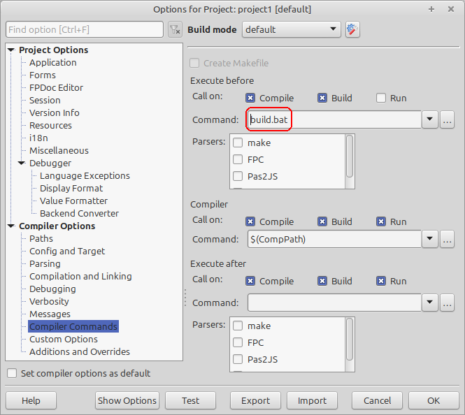
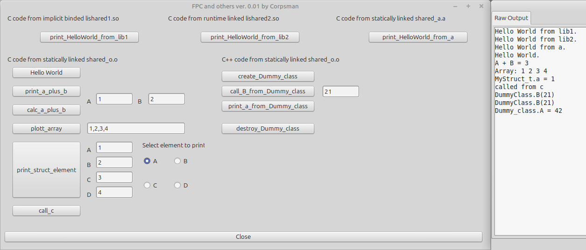

# FPC and others

As a developer and user of a lot of other libraries like OpenGL or SDL there is often the need to include source code from other languages (like Phyton, C, C++, Java, node.js ..).

In this "research" i try to evaluate the different ways on how to include code written in other languages into a FreePascal application and also give tipps and tricks on how to actually do this.

### Short Summary
* use C compatibility when writing libs or adding plugin support to applications
* evaluate carefully the pros and cons of the different techniques

### Detailed Discussion

When developing applications with FreePascal, developers occasionally need to rely on external functionalities. These can range from simple code snippets to more complex integrations, such as connecting to a rendering engine or a sound library. Often, however, such functionalities are not natively available in FreePascal. The same applies when a developer wants to make their application extensible for others, for example through plugins - such as the AI plugin provided by [FPC_Atomic](https://github.com/PascalCorpsman/fpc_atomic).


A common denominator that has emerged is the C programming language. Its structure is relatively simple, yet it provides everything necessary to extend applications. However, there are many versions of C. Code written in **C89** can usually be translated to FreePascal without major issues. Features introduced in later standards, such as the complex number type in **C99** or anonymous structures, cannot be transferred one-to-one.  
The same principle applies to other programming languages as well. For example, if you want to connect a Kotlin or Java application with FreePascal, C once again serves as the shared foundation. Additionally, most system APIs are implemented in C, which further reinforces its role as the universal interface between different programming environments.

Depending on the scope of the code to be integrated, it can be beneficial to choose different approaches for incorporating it. The following sections will examine and compare various integration methods. Special attention will also be given to potential challenges and edge cases that may arise during implementation.

The following three use cases will be examined in detail:

* **Transpiling: Directly Porting Code from Other Languages**
  Converting code written in another language into FreePascal-compatible code.

* **Integrating Libraries (`.dll`, `.so`, `.dylib`)**
  Linking external dynamic libraries to extend functionality.

* **Special case: Integrating intermediate compilation artifacts (.a, .o)**
  Using compiled object files or static archives directly within FreePascal projects.

Before diving into the analysis of the individual use cases, it is important to first consider the specific characteristics involved in integrating C code. These characteristics primarily concern the interface layer - namely, function calls and the handling of associated parameters. Since these aspects are relevant across all three use cases, they will be discussed collectively in this section.

### Common Interface Challenges when integrating / porting C Code

The foundation of all data types typically lies in the basic types - such as `integer`, `boolean`, and `float`. In FreePascal, C-compatible equivalents of these types are provided in the `ctypes` unit. However, the naming conventions used in `ctypes` differ from those found in the widely adopted C standard header `stdint.h`. See the following table for the mappings:

> **⚠️ Warning:**  
> - In `ctypes.pas`, `cbool` is mapped to `longbool`, which occupies **4 bytes** and uses `-1` to represent `true`.  
>   This can lead to subtle bugs when translating modern C code: starting with **C23**, `_Bool` / `bool` typically occupies **1 byte**, with `1` representing `true`.  
> - The size of `long` differs by platform:  
>   - On **Linux**, `long` is usually **64-bit**.  
>   - On **Windows**, `long` is typically **32-bit**.  
> - Be careful with `wchar_t`: it does **not** map directly to FreePascal's `WideChar`. The size and encoding of `wchar_t` vary between platforms and compilers, so explicit handling is required for correct interoperability.

Handling strings presents a particularly tricky challenge. In C, strings are represented as null-terminated arrays of characters and lack built-in memory management. In contrast, FreePascal strings are managed by the language itself and do not rely on null-termination. For interoperability, the appropriate type in FreePascal is `PChar`, which corresponds to a C-style `char*`.

To ensure that structures are compatible with C, the compiler directive `{$PACKRECORDS C}` must be enabled in the respective unit. This instructs the FreePascal compiler to align the fields within a record according to C conventions. 

>⚠️ Note that the `packed` keyword overrides this behavior in both languages and must be set consistently when porting code.

This structure will be aligned just like the following C struct:
```C
struct Example {
    uint8_t a;
    uint32_t b;
};
```
Converts to 
```pascal
{$mode objfpc}
{$PACKRECORDS C}

type
  TExample = record
    a: cuint8;
    b: cuint32;
  end;
```
> 💡 Without {$PACKRECORDS C}, FreePascal might insert padding differently, leading to mismatches in memory layout when exchanging data with C code.


Enumeration types are relatively easy to port from C to FreePascal. The enum itself should be declared as `cint`, and all elements of the original C enum should be converted into constants — as demonstrated in projects like [FPC_Doom](https://github.com/PascalCorpsman/FPC_DOOM).

Here is a example how to convert this:
```c
enum WeaponType {
    WEAPON_PISTOL = 0,
    WEAPON_SHOTGUN = 1,
    WEAPON_ROCKET = 10
};

int weaponDamage[11]; // Indexed by WeaponType
```
converts to

```pascal
type
  TWeaponType = cint;
const 
  WEAPON_PISTOL = 0;
  WEAPON_SHOTGUN = 1;
  WEAPON_ROCKET = 10;
var
  weaponDamage: array[0..10] of Integer;
begin
  weaponDamage[WEAPON_ROCKET] := 100;
end;
```

Unions are available in both C and FreePascal and can generally be translated 1:1 between the two languages.

```c
union Data {
    int i;
    float f;
    char c;
};
```
converts to

```pascal
type
  TData = record
    case Integer of
      0: (i: Integer);
      1: (f: Single);
      2: (c: Char);
  end;

```
>💡 Note: In FreePascal, unions are implemented using variant records with a case selector. The selector value is not stored unless explicitly declared, so it serves only as a syntactic mechanism to define overlapping fields.

Bitfields can be ported using the following approach:

```c
struct test_struct_t {
    unsigned Field1Bit: 1;
    unsigned Field2Bit: 2;
    unsigned Field5Bit: 5;
}
```
converts to

```pascal
type
  test_struct_t = bitpacked Record
    Field1Bit: 0..(1 Shl 1) - 1;
    Field2Bit: 0..(1 Shl 2) - 1;
    Field5Bit: 0..(1 Shl 5) - 1;
  End;
```

If bit fields are part of the interface, they must be ported one-to-one. However, if they are only part of an internal structure, it can actually be more efficient to omit `bitpacked` for performance reasons. This is because the compiler needs to insert complex bit manipulation operations behind the scenes to allow access. Today, the additional memory consumption is negligible compared to the computational overhead required for these operations.

Simple `#define` constants can usually be translated 1:1 into FreePascal using `const` declarations. However, preprocessor macros—especially those involving parameters, token pasting (`##`), or conditional logic—must be manually "unfolded" and rewritten in Pascal. This process can be non-trivial and often requires a deep understanding of the macro's expansion behavior.

```c
#define SQUARE(x) ((x) * (x))
```
converts to 

```pascal
function SQUARE(x: Integer): Integer; inline;
begin
  Result := x * x;
end;
```
> **⚠️ Warning:**  
> At this point, a word of caution: the C preprocessor **replaces** `#define` macros before compilation. A call such as `j = SQUARE(i++);` can lead to highly unintuitive results.
> The correct translation in FreePascal would be:  
> ```pascal
> j := (i + 1) * i;
> i := i + 1;
> ```
> See also [lessons_learned](https://github.com/PascalCorpsman/FPC_DOOM/blob/main/lessons_learned.md) from the FPC_Doom porting process.

C headers often contain `static inline` functions that are not exported. These functions must be manually ported and made available to the FreePascal code.
An example would be:

```c
static inline double square(double x) { return x * x; }
```

Now that we've covered type definitions and constants, we can turn our attention to the actual porting of functions and procedures, including their parameters. As an example, consider the following C function:

```c
bool magic_function(int* data, int len, int* res);
```

This function takes a pointer to an integer array (data), its length (len), and a pointer to an integer where the result will be stored (res). It returns a boolean value indicating success or failure.

it is naive converted to

```pascal
function magic_function(data: PCint; len: cint; res: PCint): cbool; cdecl;
```
While the ported function is technically correct, it may feel unintuitive or cumbersome for typical FreePascal developers due to the use of raw pointers and C-style types. A more idiomatic and readable version could look like this:

```pascal
function magic_function(const data: array of cint; len: cint; out res: Integer): cBool; cdecl;
```

This small example nicely illustrates one of the key challenges in porting C headers: although both `data` and `res` are pointers in the original C function, they are translated differently in the Pascal-friendly version - `data` becomes a `const` dynamic array, while `res` becomes an `out` parameter.

This distinction reflects their intended usage: `data` is read-only, while `res` is written to by the function. If `magic_function` were to modify the contents of `data`, the `const` modifier would no longer be appropriate, and the parameter would need to be declared as `var` instead.

> ⚠️ Correctly interpreting the semantics of pointer parameters is crucial when porting C functions to Pascal. Misinterpreting read/write intent can lead to subtle bugs or incorrect behavior.

Due to differences in how the FreePascal and C compilers handle the call stack and function calling conventions, it is essential to explicitly mark ported function declarations with the `cdecl` keyword. This ensures that the function uses the C calling convention, which is necessary for correct parameter passing and stack cleanup when interfacing with C libraries.

> **💡 Hint:**
> Without `cdecl`, the compiler may use the default Pascal calling convention, which can lead to stack corruption or crashes when calling external C functions.  
> **Important:** When making system API calls on Windows, the calling convention may not be `cdecl` but `stdcall`. Always verify the correct convention for each function and declare it explicitly in your FreePascal code to avoid runtime errors.

The `cdecl` keyword must also be used when defining callback types to ensure that the calling convention matches that of the C code.

```c
typedef void (*log_callback_t)(const char* message);
```
converts to 

```pascal
type
  TLogCallback = procedure(message: PChar); cdecl;
```

> ⚠️ **Warning:** Since these are manual type and function declarations, the FreePascal compiler can only partially verify their correctness against the original C code. Whenever possible, use tools like [`h2pas`](https://wiki.freepascal.org/H2Pas) to assist in generating accurate Pascal bindings from C header files. `h2pas` is also available in the Lazarus IDE as [`H2Paswizard`](https://wiki.freepascal.org/H2Paswizard). While `h2pas` may not handle all edge cases perfectly, it provides a solid starting point and helps avoid common mistakes in manual translations.

The examples above all demonstrate how FreePascal code can call into C libraries. However, in some cases, the situation is reversed: a C library or external code expects to call back into user-provided functions. This scenario is not covered by tools like `h2pas`, as it requires the FreePascal code to *provide* the expected symbols so that the linker can resolve them correctly.

In such cases, the FreePascal code must explicitly define and export the required functions using the correct name and calling convention. A common example is providing a standard C function like `memset`, which may be expected by older or embedded C libraries.

```pascal
function memset(str: Pointer; c: cInt; n: csize_t): Pointer; cdecl; public name
  {$IFDEF CPU64} 'memset' {$ELSE} '_memset' {$ENDIF};
```
> 💡 This declaration ensures that the FreePascal linker exports a symbol named memset (or _memset on 32-bit platforms), using the C calling convention. This allows C code to call into the Pascal implementation as if it were a native C function.

## Transpiling: Directly Porting Code from Other Languages

#### Transpiling by hand

At first glance, directly porting code from other programming languages to FreePascal may seem like the most straightforward and reliable approach. In fact, I have successfully ported several projects from C/ C++ or node.js to FreePascal, including:

- **[Biosim](https://github.com/PascalCorpsman/biosim4_FPC_translation)** – a simulater for biological creatures that evolve through natural selection
- **[FPC_DOOM](https://github.com/PascalCorpsman/FPC_DOOM)** – a Pascal-based port of the classic Crispy DOOM engine  
- **[Cyclone](https://github.com/PascalCorpsman/FPC_cyclone-physics)** – a lightweight physics engine
- **[The Coding train](https://github.com/PascalCorpsman/TheCodingTrain)** - lots of small examples for different topics

These projects demonstrate that, with careful attention to detail, even complex codebases can be translated into clean and maintainable FreePascal code.

When porting code manually from another language to FreePascal, the following pros and cons typically arise:

#### ✅ Advantages
- **Full control** over the resulting code structure and design decisions
- **Integration with existing FreePascal libraries** and coding conventions
- **Improved portability**, as the result is native FreePascal code
- **No runtime dependencies** on external C libraries or compilers
- **Deep understanding of the codebase**, which can lead to:
  - Easier debugging
  - Opportunities for **refactoring** or **optimizing**
  - **Bug fixes** or improvements during the porting process

#### ❌ Disadvantages

- **High effort and time investment**, especially for large or complex codebases
- **Manual maintenance**: changes in the original source must be tracked and re-applied
- **Risk of introducing new bugs** during translation
- Requires **good understanding of the source language**, including its idioms and edge cases
- **Hidden pitfalls**, such as subtle differences in memory layout, type sizes, or undefined behavior (see *[Lessons Learned](https://github.com/PascalCorpsman/FPC_DOOM/blob/main/lessons_learned.md)* from `FPC_DOOM`)
- **Potential performance regressions**, some implementations in FreePascal are inefficient (e.g. `tanh` implementation in `biosim`) see [here](https://forum.lazarus.freepascal.org/index.php?topic=47937.50) for further reference
  
> 💡 In summary: manual transpiling is a powerful but demanding approach. It is best suited for projects where long-term maintainability, deep integration, or independence from C toolchains is a priority.


#### Transpiling with AI Assistance: Updated Pros and Cons

The use of AI systems as translation aids has become increasingly common. When AI is involved in the transpiling process, the balance of pros and cons shifts accordingly:

#### ✅ Additional Advantages

- **High speed**: Large codebases can be translated in a fraction of the time compared to manual porting.
- **Reduced need for deep source language knowledge**: Developers can rely on the AI to interpret unfamiliar constructs or idioms.
- **Good for prototyping**: Quickly generate a working baseline for further manual refinement.

#### ❌ Additional Disadvantages

- **Risk of semantic misunderstandings**: AI may produce code that *looks* correct but misinterprets the original logic or intent.
- **Compilation issues**: Generated code often does not compile out of the box, especially when targeting FreePascal, due to:
  - Missing or incorrect type mappings
  - Unsupported language features
  - Incomplete function definitions
- **False confidence**: The code may appear syntactically valid but contain subtle logic errors.
- **Limited context awareness**: AI may not fully grasp project-specific conventions, macros, or build systems.
- **No automatic maintenance**: AI-generated code must still be manually updated when the original source changes.

> ⚠️ AI can be a powerful tool for accelerating transpiling, but it should be used with caution. Always review and test the output thoroughly, and treat it as a *starting point*, not a finished product.

## Integrating Libraries (`.dll`, `.so`, `.dylib`)

The most commonly used approach for reusing external code in FreePascal is through dynamic libraries - platform-specific shared objects such as `.dll` (Windows), `.so` (Linux), or `.dylib` (macOS). This method allows developers to access complex functionality without having to port the entire codebase.

To port the corresponding C header files, you can follow the guidelines outlined earlier in this article. Tools like [`h2pas`](https://wiki.freepascal.org/H2Pas) can assist in generating initial bindings, and AI-based tools may further the process—though manual review is always recommended.


In general, there are two ways to integrate libraries into one's own code:
**dynamic linking with implicit bindings** and **dynamic linking at runtime**.  
In the following sections, the advantages and disadvantages of both approaches will be discussed separately.

#### Dynamic Linking with Implicit Bindings

#### ✅ Advantages
- The usage feels natural, as no additional steps are required in the code to load the library.
- The operating system automatically resolves dependencies at startup, simplifying deployment.
- Function calls to the library are directly available, improving readability and maintainability.

#### ❌ Disadvantages
- The application may crash with obscure or hard-to-diagnose errors if the library is not available at startup.
- Version mismatches or missing dependencies can lead to runtime failures that are difficult to trace.
- The executable has a hard dependency on the presence of the DLL, reducing flexibility in deployment environments.
- Debugging is often limited, as third-party libraries are frequently distributed without debug symbols.


#### Dynamic Linking at Runtime

#### ✅ Advantages
- Libraries can be swapped at runtime, offering greater flexibility.
- Libraries are only loaded when actually needed, which can reduce memory usage and startup time (e.g., SDL2 in [FPC_Atomic](https://github.com/PascalCorpsman/fpc_atomic)).
- Enables optional features without hard dependencies, improving modularity.

#### ❌ Disadvantages
- Additional code is required to load and bind the library functions, which may not be intuitive for beginners.
- Debugging is often limited, as source code or debug symbols are usually not available.
- Error handling becomes more complex, as missing or incompatible libraries must be detected and managed manually.
- Function calls are typically resolved via pointers, which can reduce code readability and increase the risk of runtime errors.

### Special Case: Integrating Intermediate Compilation Artifacts (.a, .o)

While the two approaches discussed above can be applied to many programming languages, this chapter focuses on a special case: integrating C/C++ artifacts into FreePascal.

This scenario is relevant because C and C++ are extremely widespread, and their combination with FreePascal offers unique advantages. By leveraging intermediate compilation artifacts such as `.a` (static libraries) and `.o` (object files), developers can reuse existing codebases efficiently without requiring full source-level integration. Moreover, compiling these artifacts manually enables full debugging support within the Lazarus IDE, as developers can include debug symbols during the build process.

The exact techniques for achieving this integration will be demonstrated using the provided demo code. For this reason, this section focuses on an overview and highlights only the key specifics rather than a full step-by-step guide.

1. Port C/C++ Headers:<br>
Convert the required headers to FreePascal units, either manually or using **H2Pas**.
2. Link C/C++ libraries:<br>
   - If the code uses standard C functions (e.g., `printf`), link the C runtime library:
     ```pascal
     {$IFDEF Windows}
       {$LINKLIB msvcrt}
     {$ELSE}
       {$LINKLIB c}
     {$ENDIF}
     ```
   - If the code uses C++ features, link the C++ standard library:
     ```pascal
     {$IFDEF Windows}
       {$LINKLIB libstdc++.dll.a} // this could differ on your machine, depending on the used gcc   compiler
     {$ELSE}
       {$LINKLIB c++}
     {$ENDIF}
     ```
3. Link g++ Output Files<br>
   Depending on the artifact type:  
   - For `.a` files (static libraries):
     ```pascal
     {$LINKLIB libshared_a.a}
     ```

   - For `.o` files (object files):
     ```pascal
     {$LINK obj/shared_o.o}
     ```
#### ✅ Advantages
- Can be automated during the pre-build process, reducing manual effort.
- Fully debuggable when using **GDB** and including debug symbols during compilation.
- Enables reuse of existing C/C++ code without requiring full source-level integration.
- Offers better performance compared to dynamic linking, as symbols are resolved at compile time.

#### ❌ Disadvantages
- Requires a working **GCC toolchain**, and often additional tools like **Make**.
- On Windows, setup can be complex (e.g., **Cygwin**, **MSYS2**), while Linux environments are typically easier.
- Increases build complexity, especially when mixing multiple platforms or architectures.
- Potential for ABI incompatibilities between C/C++ and FreePascal if compiler settings differ.

### Compile / Run the Demo Application
Setting up the build environment differs significantly between Windows and Linux:  
- **Windows:** Requires a proper GCC toolchain (e.g., MinGW) and may involve additional steps like configuring PATH variables or installing MSYS2/Cygwin for Unix-like tools.  
- **Linux:** Typically easier, as GCC and Make are often pre-installed or available via package managers.  
Make sure the correct toolchain is available before compiling to avoid linker errors.

#### Windows:

- As the uploaded code is designed to be used under Linux you need to switch from `build.sh` to `build.bat`.
  
- Set up **MinGW** (or an equivalent toolchain) if not already installed.
- Press **F9** to build and run the application.

#### Linux:
- make "build.sh" executable (chmod +x build.sh)
- Use **CTRL + F9** to compile.
- Execute `install_libshared1_so.sh`  
  *(If this step is skipped, the debugger will crash because the implicid binded library is missing.)*
- Press **F9**, run, and have fun 😉

If everything worked correctly, the application should start and look approximately like this:


> **⚠️ Note:**
> The output of the buttons is displayed in the console.  
> - On **Windows**, the console appears automatically.  
> - On **Linux**, the output can be viewed by enabling the console view under the debug menu.
> 
## Conclusion

The choice of technique (transpiling, linking libraries, or integrating compilation artifacts) depends on multiple criteria and must be evaluated on a case-by-case basis.

If the code is **not transpiled**, the following considerations are essential:

- Integrating C++ code requires a *flattened* interface, as direct access to classes is not possible  
  *(COM applications were not considered in this context).*
- Exceptions must **never propagate** beyond the C/C++ boundary to avoid undefined behavior.
- Ensure proper memory management across language boundaries to prevent leaks or crashes.
- Pay attention to calling conventions and data type alignment to maintain ABI compatibility.
- Debugging support depends on whether debug symbols are included during compilation and whether the Lazarus- IDE is configured correctly.
