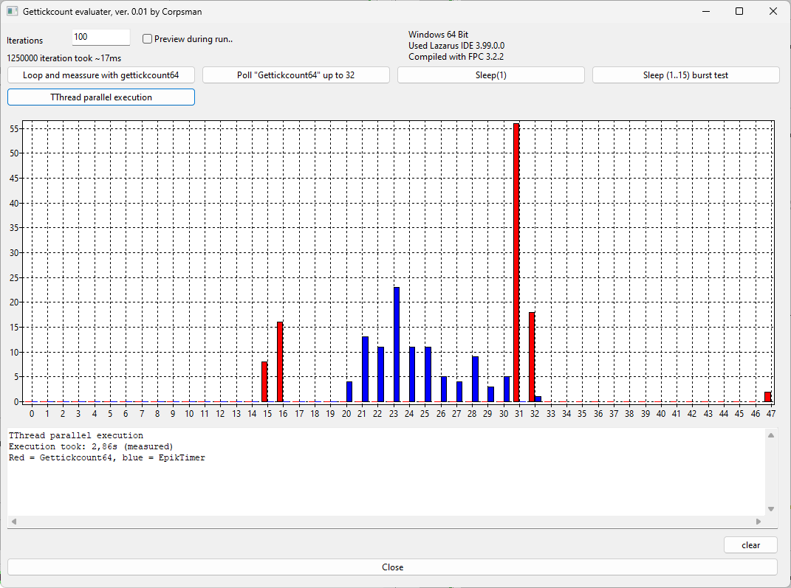
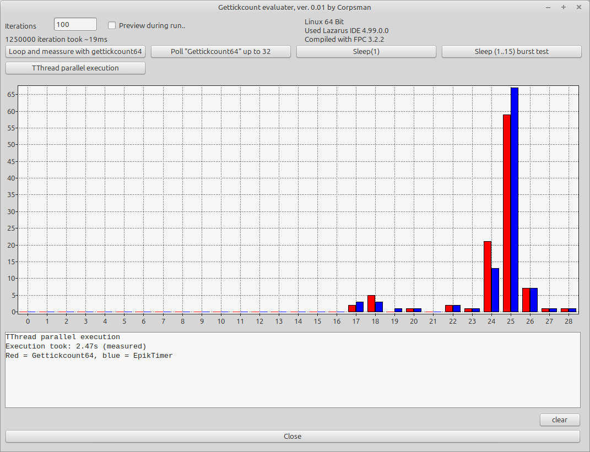
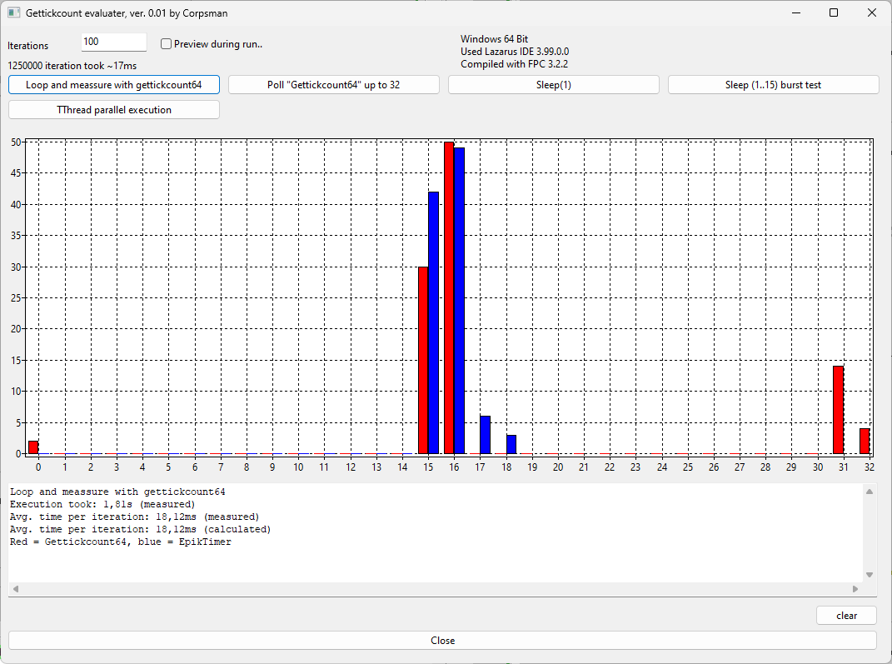
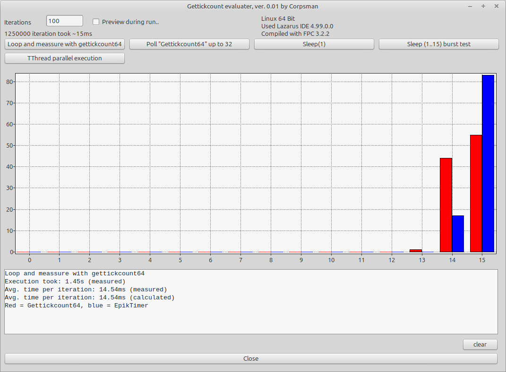
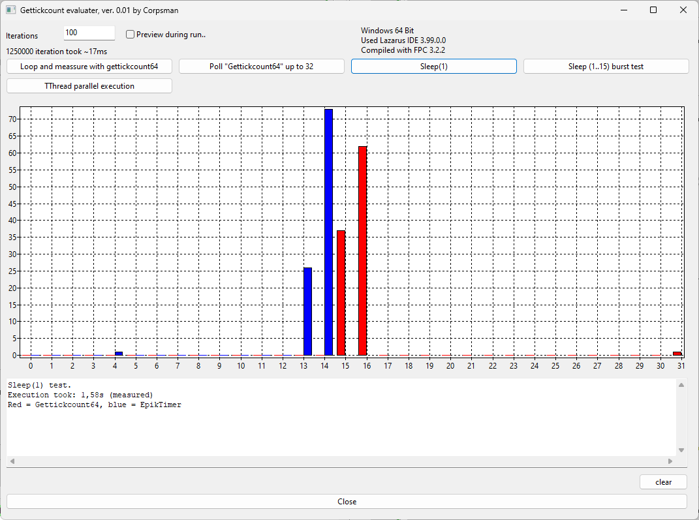
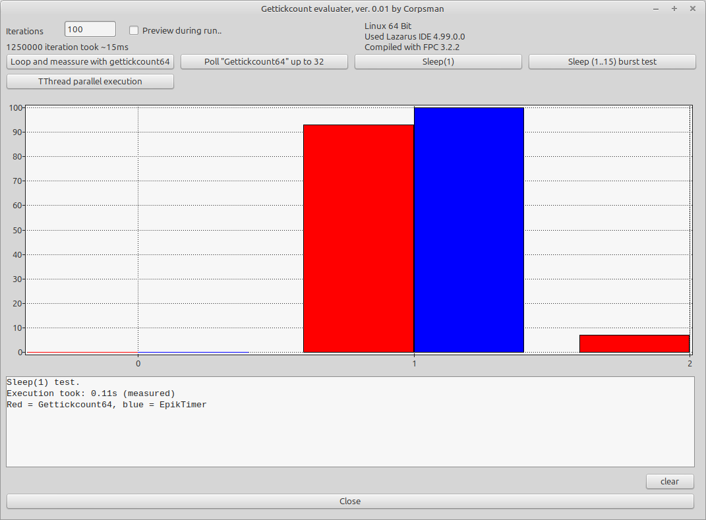
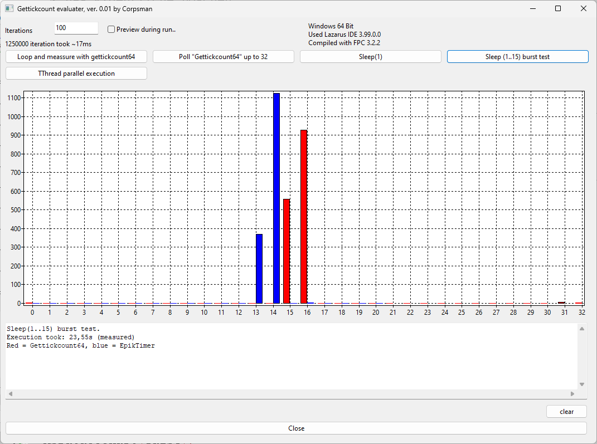
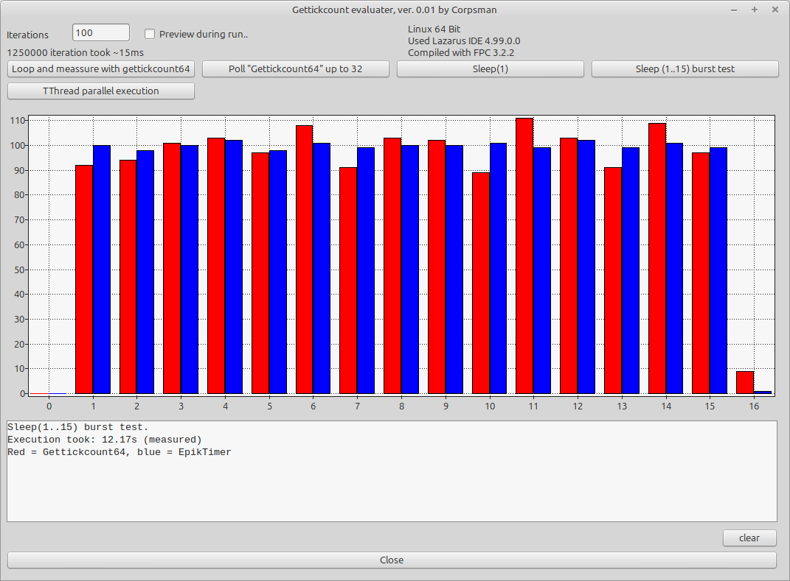

# GetTickCount64

During the development of [Biosim](https://github.com/PascalCorpsman/biosim4_FPC_translation), I noticed some strange behavior with `GetTickCount64` (the same also occurs with `GetTickCount`). See the related [topic in the Lazarus forum](https://www.lazarusforum.de/viewtopic.php?p=131619&hilit=16ms#p131619).

In this “research,” I compare the Linux64 and Windows64 versions and try to collect information about *why* this behavior occurs.

### Short Summary

The Windows scheduler operates in 16 ms time slices.  
Avoid using `GetTickCount64` (use TEpikTimer instead) or `TThread` when measuring or handling very short tasks.

### Detailed Discussion

When measuring time deltas on Windows64, everything appears to run "slower" than on a Linux64 machine—even if the Windows64 machine has a more powerful CPU. The same effect occurs when using the `TThread` class to take advantage of multiple CPUs. According to some sources, this behavior is caused by the Windows64 scheduler, which works in 16 ms slices ([see this discussion on StackOverflow](https://stackoverflow.com/questions/8322826/is-16-milliseconds-an-unusually-long-length-of-time-for-an-unblocked-thread-runn)).

On the other hand, when using `GetTickCount64` on a Linux64 machine, everything behaves as expected. The Linux64 scheduler uses a mechanism called [futex](https://de.wikipedia.org/wiki/Futex), which allows for much faster thread switching.

#### Reproducing the Original Behavior from Biosim

In [Biosim](https://github.com/PascalCorpsman/biosim4_FPC_translation), this effect becomes noticeable when simulating a generation. During a generation, multiple `TThread` instances evaluate the independent life of each individual, and at the end the algorithm waits for all threads to finish.  

When comparing runs on Windows64 versus Linux64, I observed that—even though the Windows64 machine was more powerful—it executed more slowly. To investigate this, I started measuring the time (in ms) required for all threads to finish. On Windows64, this time was almost always around **16 ms**, whereas on Linux64 the values varied.  

To demonstrate this effect in isolation, I wrote a small application as part of this research.

| Windows64 | Linux64 | 
| --- | --- |
|  |  |

The two images show the `TThread` runs on Windows64 and Linux64. Both variants ran 100 iterations. In each iteration, the application created eight `TThread` instances performing calculations that should take approximately 10–20 ms.  

In the images, the results from `GetTickCount64` are shown in red, while the “parallel” measurements using `TEpikTimer` are shown in blue. On Linux64, the `TEpikTimer` results match the `GetTickCount64` measurements, as expected. On Windows64, however, the results differ: the red lines follow an approximate 16 ms pattern, even though the blue lines clearly show a different timing pattern.

#### Single threaded load analysis

In order to clearer see the effects i removed the TThread class and did the same calculations again in singlethread mode.

| Windows64 | Linux64 | 
| --- | --- |
|  |  |

Again on Linux64 GetTickCount64 and the control TEpikTimer match. On the Windows64 side there are results from 0ms to 32ms, with the most results at around 16ms.

#### How Long is `Sleep(1)`?

To test the hypothesis that the effect on Windows64 comes from the task scheduler, I skipped the calculations and yielded the CPU back to the OS by calling `Sleep(1)`. If the hypothesis is correct, there should be no measurements shorter than 16 ms in the Windows64 diagram.

| Windows64 | Linux64 | 
| --- | --- |
|  |  |

As expected, on Linux64 the sleep duration is nearly always around 1 ms. On Windows64, all `GetTickCount64` calls report 15–16 ms, which further supports the idea that the Windows scheduler works in 16 ms slices. This is confirmed by the blue control measurements, which show that the application only receives CPU time during these 16 ms intervals.

#### Does `GetTickCount64` Work Correctly?

Inspired by the first two tests, I wanted to evaluate whether `GetTickCount64` can be used to measure very short time intervals (<16 ms). During my research, I also found this [topic on the Lazarus forum](https://forum.lazarus.freepascal.org/index.php?topic=41430.15), which suggests that `GetTickCount64` only works in 16 ms slices on Windows.

For the test scenario, I called `Sleep` with durations from 1 ms to 15 ms and measured the elapsed time. Based on the previous tests, I expected the Windows64 scheduler to consume the entire 16 ms slice, resulting in a solid 16 ms “tube” of measurements. On Linux64, I expected the results to be more evenly distributed across all values from 1 to 15 ms.

| Windows64 | Linux64 | 
| --- | --- |
|  |  |

The results confirmed this hypothesis 😉.

## Conclusion

Starting with a rough guess, I found that on Windows64 there are two factors causing the observed behavior:  
- The Windows64 scheduler operates in 16 ms slices (see [Test 1](#reproducing-the-original-behavior-from-biosim) and [Test 3](#how-long-is-sleep1)).  
- The `GetTickCount64` function on Windows64 also reports time in 16 ms slices (see [Test 3](#how-long-is-sleep1) and [Test 4](#does-gettickcount64-work-correctly)).  
- The effect does not make a difference when used in single ore multithread mode (see [Test 1](#reproducing-the-original-behavior-from-biosim) and [Test 2](#single-threaded-load-analysis))

On Linux64, everything behaves as expected.

**Practical takeaways:**  
- When using the `Sleep` function, be prepared for the actual sleep time to be longer than requested on Windows64.  
- `GetTickCount64` is suitable for measuring longer durations.  
- For higher precision timing on Windows64, consider using `TEpikTimer`.

### Discussion of Reliability of the Results

The timing measurements were taken on a Linux Mint Mate 22.2 (**AMD Ryzen 7 7730U with Radeon Graphics**) and a Windows 11 (**Intel® Core™ Ultra 7 Processor 165H**) machine.  

Due to the limited number of systems tested, these results cannot be fully generalized. Feel free to run the test application on your own machine and share any differing results.
